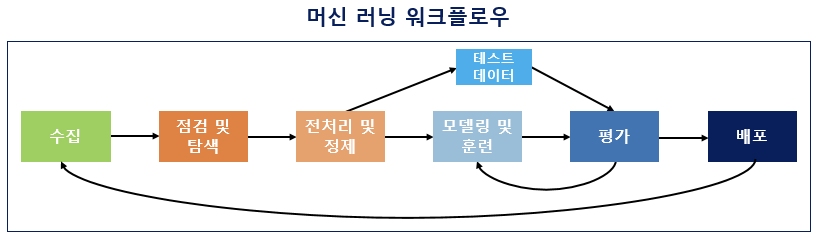

# 머신러닝 기본 개념

### 범주

- 인공지능
    - 지식기반, 규칙기반 인공지능 (코드대로 수행)
- 머신러닝
    - 인공지능의 한 분야, 주어진 데이터를 기반으로 패턴파악 후 학습 → 예측, 분류
- 딥러닝
    - 머신러닝의 한 분야, 신명망 구조를 기반으로 학습

<aside>
💡 특성 데이터  : 피처 데이터 
답 : 타깃 데이터 
→ 피처 + 타깃 = 분류(classification)
→ 피처 데이터로만 학습 후 분류 = 클러스터링(clustering 군집화)

</aside>

### 머신러닝 학습 분류

- 지도학습 (답이 있는 데이터)
    - K-최근접 알고리즘
    - 선형 회귀 분석
    - 로지스틱 회귀 분석
    - 나이브 베이즈
    - 의사결정 나무
    - 서포트 벡터 머신

- 비지도 학습 (답이 없는 데이터)
    - K-평균 클러스터링
    - 계층 클러스터링
    - DBSCAN
    - 가우시안 혼합 행렬
    - 주성분 분석

### 머신러닝의 목표

- 데이터 관계, 패턴을 학습 → 분류 혹은 예측하는 것
- 이런 학습을 통해 판단하는 알고리즘 → 모델

### 파라미터와 하이퍼파라미터 (ML 모형의 특성을 나타내는 요소)

- 파라미터(Parameter)
    - 주어진 데이터로부터 구함
    - ex) 정규분포의 파라미터 → 분산, 평균 (데이터로 부터 뽑는다)
- 하이퍼파라미터(Hyperparameter)
    - 외부 사용자가 직접 입력 (입력값은 예측, 분류 성능이 높은 모형을 위한 K 값)
- 주어진 목표
    1. 주어진 데이터로 부터 최적의 파라미터$_{parameter}$를 구하고
    2. 하이퍼파라미터$_{Hyperparameter}$튜닝을 통해 모형 성능을 높힌다

⇒ 이를 위해서 프로그래밍 구현 능력 + 이론 (선형대수 + 통계학적 개념) 필요하다 

### 머신러닝 워크플로우

데이터 수집하고 머신러닝하는 과정을 6가지로 나누면 다음과 같다.

1. ***수집***
    - 머신러닝을 위한 데이터, 자연어 처리를 위한 데이터 - 코퍼스(corpus)
    
    → 조사, 연구 목적에 의해 수집된 텍스트 집합 (txt, csv, xml 등 출처 다양)
    
2. ***점검 및 탐색***
    - 데이터 점검 및 탐색
    
    → 데이터 구조, 노이즈 데이터, 머신러닝을 위한 데이터 정제 과정 파악
    
    - 탐색적 데이터 분석단계 (Exploratory Data Analysis EDA)
        - 독립 변수
        - 종속 변수
        - 변수 유형
        - 변수의 데이터 타입
        
        등을 점검하며 특징과 구조적 관계를 알아내는 과정
        
3. ***전처리 및 정제***
    - 머신러닝 워크플로에서 가장 까다로운 작업
    - 자연어 처리 - 토근화, 정체 , 정규화, 불용어 제거 등 포함
    - 사용 툴에 대한 다양한 라이브러리 지식 필요하다
4. ***모델링 및 훈련***
    - 머신러닝 코드 작성 단계
    - 적절한 머신러닝 알고리즘을 선택해 모델링 후 전처리 완료된 데이터로 학습 진행 → 훈련이라고 함
    - 원하는 방향으로 훈련이 진행되었다면 태스크에 대한 올바른 결과 도출
    
    → 모든 데이터를 기계에게 학습 시키면 안된다 (?? 일부는 테스트용으로 나둬야 한다)
    
    → 훈련, 검증, 테스트 데이터로 나뉨
    
    검증 데이터는 (하이퍼파라미터 조정시 사용) 즉 검증이 모의고사 테스트 데이터가 수능이라 생각하자
    
5. ***평가***
    - 테스트용 데이터로 실제 정답과 얼마나 가까운지 측정
6. ***배포*** 
    - 성공되었다 판단되면 모델 배포 단계 → 여기서 피드백이 필요하다면 수집단계로 돌아갈 수 있다.