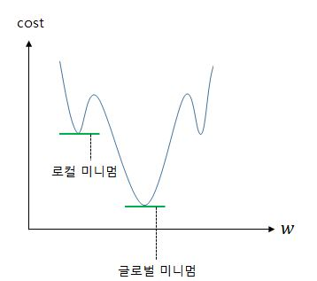
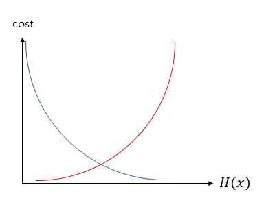

# 로지스틱 회귀
- binary 카테고리의 선택 모델이다
- 0 과 1로 출력이 나오는 이진 classification 해결 알고리즘이다.

## 시그모이드 함수
- 트레이닝 데이터셋의 분류를 0 과 1로 압축시켜 결과를 출력하는데 이를 도와주는 것이 시그모이드 함수다.

$$
g(z) = \frac{1}{1+e^{-z}}
$$

가설을 세우는 과정은 다음과 같다

$$
H(x) = \frac{1}{1 + e^{-(wx + b)}} = sigmoid(wx + b) = σ(wx + b)
$$

## 손실함수
- 로지스틱 회귀에서는 MSE를 손실함수로 사용하지 않는다. 그이유는 그래프 모양이 다음과 같아서 그렇다.

MSE를 사용해 경사하강법을 진행하면 찾고자하는 최솟값이 아닌 잘못된 최솟값에 빠질 가능성이 매우높다.
이를 글로벌 미니멈이 아닌 로컬 미니멈에 도달했다고 한다.

## 크로스 엔트로피 함수 
- 유도과정은 다음과 같다.

가중치를 최소화하는 목적함수 J가 다음과 같이 있다고 하자
$$
J(w) = \frac{1}{n} \sum_{i=1}^{n} f\left(H(x^{(i)}), y^{(i)})\right)
$$ 

데이터 갯수가 n개이고 어떤 함수 f 가 실제값과 예츠값의 오차를 나타내는 함수라고 할 때 적절한 가중치를 찾아야 함으로 실제값과 예측값의 오차를 줄이는 손실함수 f 라 하자
$$
J(w) = \frac{1}{n} \sum_{i=1}^{n} cost\left(H(x^{(i)}), y^{(i)})\right)
$$
시그모이드 함수는 1과 0 사이 값을 반환한다. 실제값이 0 이고 예측값이 1에 가까워지면 손실함수의 결과값을 늘려야한다. 그 반대도 마찬가지. 이 표현은 로그함수를 이용하여 표현 가능하다.
  
  
$$
\text{if } y=1 → \text{cost}\left( H(x), y \right) = -\log(H(x))
$$

$$
\text{if } y=0 → \text{cost}\left( H(x), y \right) = -\log(1-H(x))
$$

각각 실제값이 1과 0일 때 위에서 말했던 결과값을 내는 손실함수다.
이를 그래프로 그려보면 다음과 같다.

실제값이 1일때가 파란선
실제값이 0일때가 빨간선

이둘의 식을 합치면 
$$
\text{cost}\left( H(x), y \right) = -[ylogH(x) + (1-y)log(1-H(x))]
$$
같고

결과적으로 로지스틱 회귀의 손실함수는 다음과 같다.

$$
J(w) = -\frac{1}{n} \sum_{i=1}^{n} [y^{(i)}logH(x^{(i)}) + (1-y^{(i)})log(1-H(x^{(i)}))]
$$